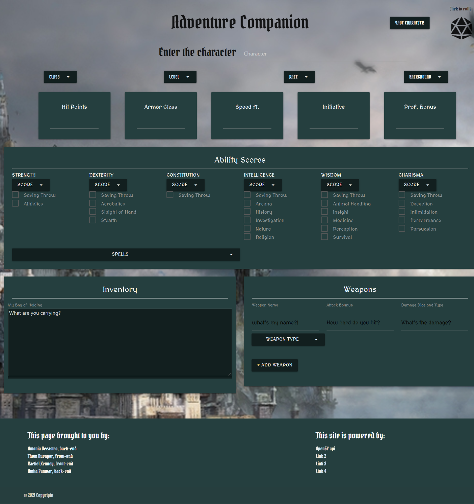
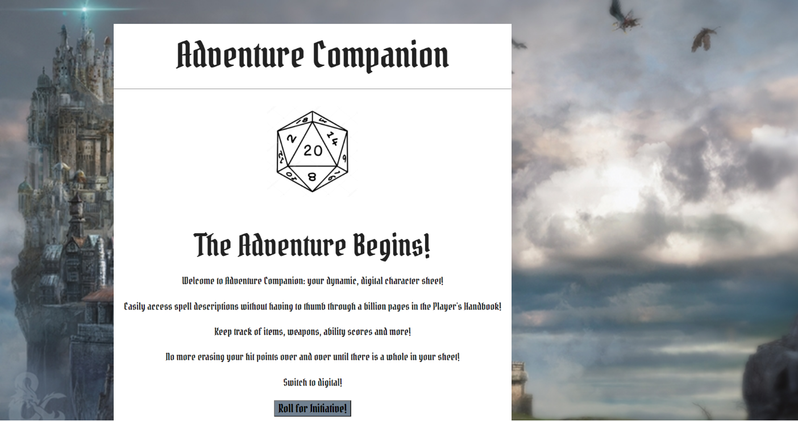

# adventure_companion

## Contents

* [Introduction](#Introduction)
* [Technologies](#Technologies)
* [Contributors](#Contributors)
* [Screenshot](#Screenshot)
* [Link](#Link)

## Introduction

The Adventure Companion project is a dynamic and digital character sheet.
The purpose of the project to remove all the hurdle player faces to fill the character sheet.
Allow the player to easily access spell descriptions without having to thumb through a billion pages in the Player's Handbook.
Allow the player to Keep track of class, level, background, weapons, ability scores and inventory.
No more erasing your hit points over and over until there is a whole in your sheet.

## Technologies

Project is created with:

* Visual Studio Code 1.51.1
* Jquery 3.2.1
* CSS-Materialize 1.0.0
* API-https://api.open5e.com/
* API-http://roll.diceapi.com/

## Contributors

* Antonio Decastro
* Fnu Amita
* Kathryn Thorsen
* Rachel Kenney
* Thomas Huenger

## Screenshot

## Link

[Adeventure Companion]()
